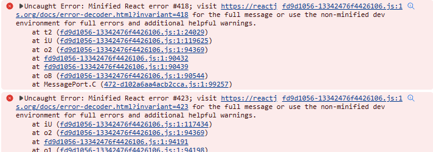

[[toc]]

# 在 Nextjs 中获取数据的正确姿势

使用Next进行SSG时，Next允许我们使用一些服务端API，如fs，
这大大降低了我们获取数据的成本，但是在使用时，我们需要注意一些问题。

## 1. Server Side Rendering

因为我们SSG的最终目的是生成静态站点，因此我们的大部分组件都是需要使用
客户端API的，而这也是Next中很坑的一点：

虽然它向我们提供了服务端和客户端的API，但是这些API并不能在同一个文件中
混用，即如果你在一个页面中使用了`useEffect`，那么这个页面就不能使用
fs来读取文件，在以前的版本中一般使用`getStaticProps`来获取数据以及
调用服务端API，但是在`Next13`以及之后的版本中，这个API不允许在`pages`
路径下使用，取而代之的事`generateStaticParams`，且该API只允许返回
动态路由的slug，因此我们并不能像之前一样在此获取数据。

这时，最容易想到的解决方法就是封装一个子组件，并在子组件中使用`useEffect`
而父组件则作为SSR的入口：

```jsx
/* eslint-disable react-refresh/only-export-components */
import React from 'react'
import ArticleCard from './Card'
import {
  getMarkdownFiles,
  getMarkdownFileBySlug,
} from '../../../utils/markdownUtils'

export interface Article {
  title: string
  author: string
  description: string
  date: Date
  tags: string[]
  slug: string
}

export default async function ArchivePage() {
  let files = await getMarkdownFiles()
  files = files
    .filter((file) => file.match(/\.md$/))
    .map((file) => file.replace(/\.md$/, ''))
  const articles: Array<Article> = []
  for (const file of files) {
    const { data } = await getMarkdownFileBySlug(file)
    const article = {
      title: data.title,
      author: data.author,
      description: data.description,
      date: data.date,
      tags: data.tags || [],
      slug: file,
    }
    articles.push(article)
  }

  return (
    <div>
      <h1>Archive</h1>
      {articles.map((article) => (
        <ArticleCard key={article.slug} article={article} />
      ))}
    </div>
  )
}

```

像这样获取数据之后，我们就会愉快的发现，至少在`yarn dev`中，一切都是
正常的，但是当我们进行部署到生产环境时，问题出现了：



打开控制台，我们就能看到一片红色的报错，虽然目前笔者还不清楚是什么原因
（欢迎大神指点），而且该页面除了有报错外其他表现均正常，但是既然出现报错
那么就说明这种方法不是官方推荐的，因此我们需要寻找其他方法。

## 2. 使用Routes Handler

查阅Next文档Data Fetching部分，我们可以看到其提供了一个`Routes Handler`
的API，该API可以在`pages/api`路径下使用，因此我们可以在该路径下创建一个
`route.ts`文件，该文件的内容如下（只是把数据获取的逻辑移动到了该文件中）：

::: tip
注意，此处的返回值必须是`Response`，且内容为json格式，否则会报错。
:::

```ts
import {
  getMarkdownFiles,
  getMarkdownFileBySlug,
} from '../../../../utils/markdownUtils'

// export const dynamic = 'force-dynamic' // defaults to force-static
export async function GET() {
  // console.log(request);
  let files = await getMarkdownFiles()
  files = files
    .filter((file) => file.match(/\.md$/))
    .map((file) => file.replace(/\.md$/, ''))
  const articles = []
  for (const file of files) {
    const { data } = await getMarkdownFileBySlug(file)
    const article = {
      title: data.title,
      author: data.author,
      description: data.description,
      date: data.date,
      tags: data.tags || [],
      slug: file,
    }
    articles.push(article)
  }
  // return {
  //   props: {
  //     articles,
  //   },
  // }
  return Response.json({ articles })
}
```

而在原先的`page.tsx`中，我们则使用`useEffect`来获取数据：

```jsx
/* eslint-disable react-refresh/only-export-components */
'use client'
import React, { useEffect, useState } from 'react'
import ArticleCard from './Card'

export interface Article {
  title: string
  author: string
  description: string
  date: Date
  tags: string[]
  slug: string
}

export default function ArchivePage() {
  const [articles, setArticles] = useState<Article[]>([])
  useEffect(() => {
    fetch('/pages/archive/api')
      .then((res) => res.json())
      .then((res) => {
        setArticles(res.articles)
      })
  }, [])

  return (
    <div>
      <h1>Archive</h1>
      {articles.map((article) => (
        <ArticleCard key={article.slug} article={article} />
      ))}
    </div>
  )
}
```

分离出了数据获取的逻辑之后，我们就可以愉快的使用`useEffect`了，
build后再部署，可以看到控制台非常干净，而且页面也正常显示。我们
成功的解决了这个问题。
